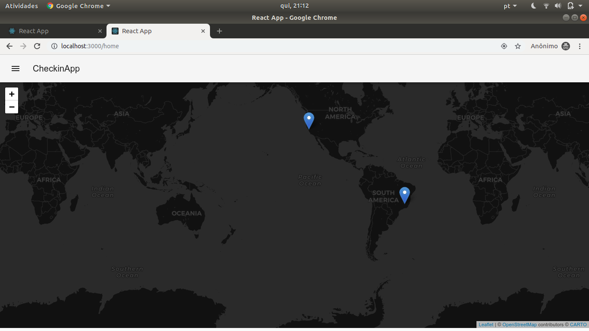

# CheckInMaster

# CheckInMaster 


É uma aplicação desenvolvida para rastrear seus amigos e quem estiver próximo na região

## Instrução para o uso

- [x] É necessário ter um MongoDB instalado na sua Máquina 
- [x] Node 10 acima

Rode o comando para instalar as dependência.
```bash
    yarn install 
```

Após isso rode a api na sua máquina e está tudo pronto e você pode rodar o (front)[]. 